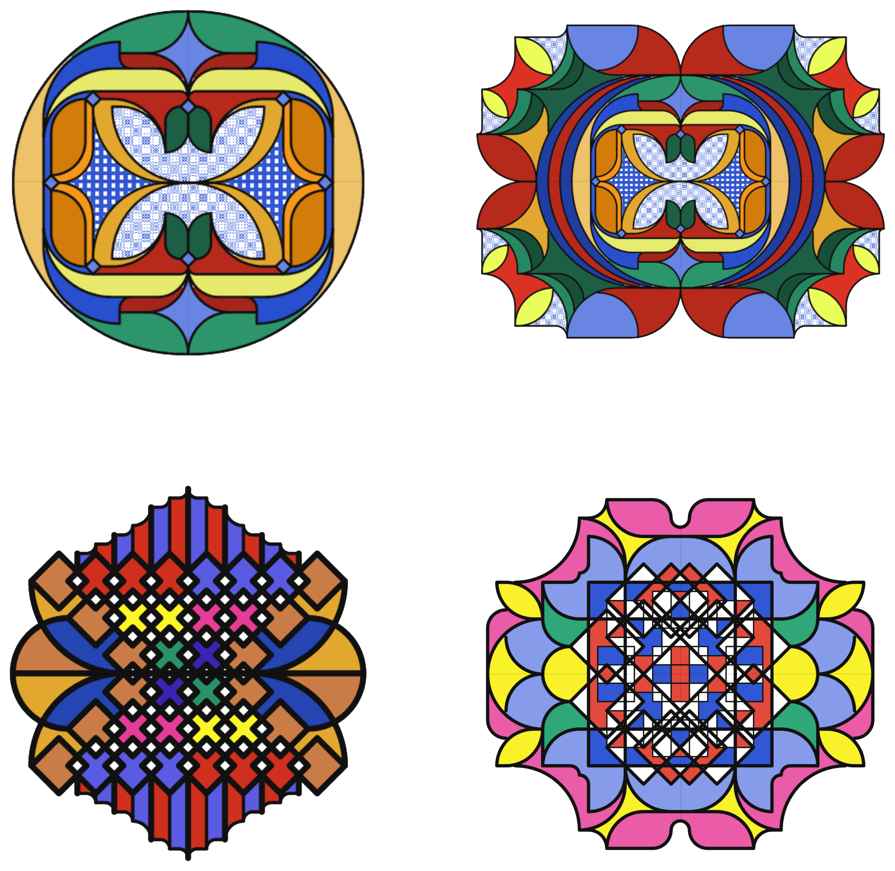
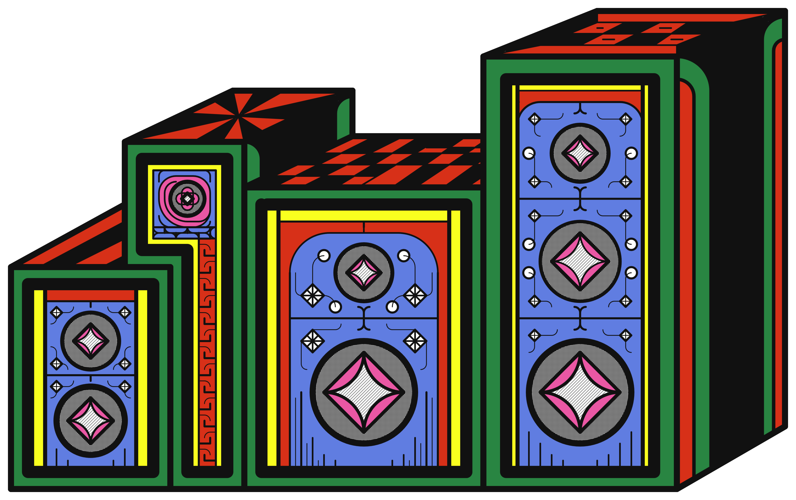
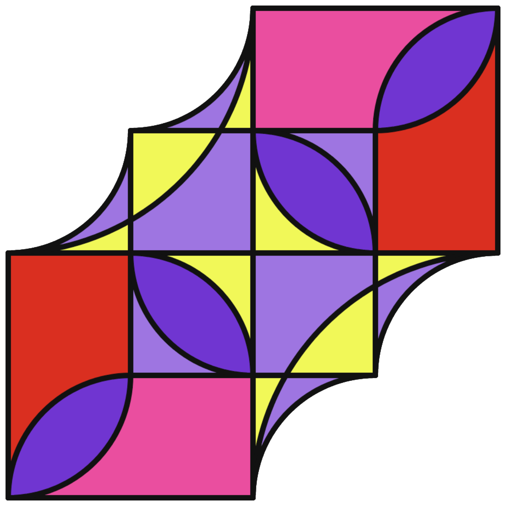
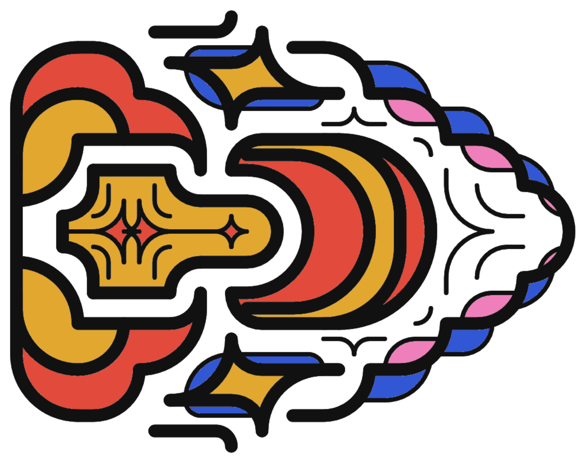
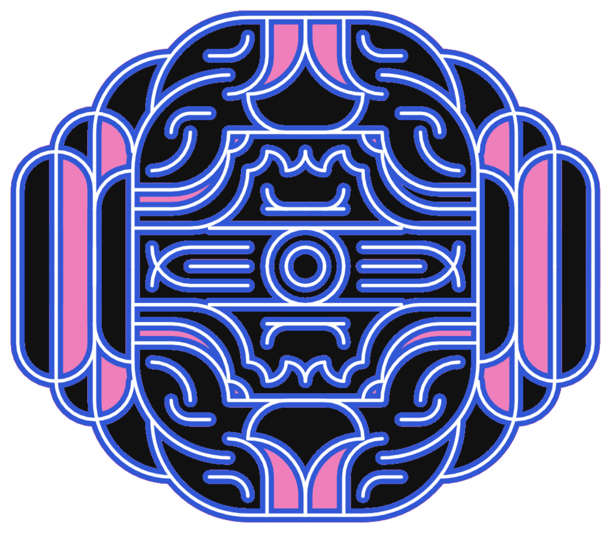

# Lines on Grids

A focused, browser-based drawing studio for building precise artwork on a dot grid.


## Live app

The repository includes an automated GitHub Pages deployment. Every push to `main` is tested, built, and published through GitHub Actions.

## Examples

Artwork created entirely in Lines on Grids. The transparent exports adapt cleanly to the page around them.

<p align="center">
  
</p>
<p align="center">
  
  
</p>
<p align="center">
  
  
</p>

## Tools

- Grid pen (`B`) — builds orthogonal and 45° paths; hold `Alt` for direct segments
- Curve pen (`C`) — creates rounded grid-aligned transitions
- Shape (`U`) — places grid-sized squares, circles, diamonds, and triangles
- Select (`M`) — selects a grid rectangle for copying, pasting, rotating, or flipping artwork
- Eraser (`E`) — cuts geometry on the active layer
- Fill (`G`) — fills enclosed regions or changes the background
- Pattern fill (`K`) — fills a region with ordered dither, diagonal, crosshatch, or stipple presets
- Eyedropper (`I`) — samples the composited canvas
- Hand (`H` or hold `Space`) — pans the workspace
- Zoom (`Z`) — click to zoom in, `Alt`-click to zoom out; the wheel zooms at the pointer

Right-click or press `Enter` to commit a path. Press `Escape` to cancel, `[` / `]` to change tool size, and `Ctrl/Cmd+Z` to undo. Use the Hand tool or hold `Space` and drag to pan.

Drawing, shapes, and fills include independent **Mirror X** and **Mirror Y** toggles. X mirrors left/right across the document center, Y mirrors top/bottom, and enabling both produces four-way symmetry. Mirrored geometry previews live and commits as one undoable action.

## Layers

Layers follow a familiar image-editor model: the active layer receives new artwork, and every layer can be renamed, reordered, hidden, locked, duplicated, cleared, deleted, and assigned an opacity. The background remains separate and locked.

Documents autosave locally. A larger IndexedDB recovery store keeps the latest and previous snapshots, including an unfinished active path, while small documents also retain a local-storage fallback. Long paths checkpoint automatically before they can exhaust browser memory. New drawings can be named and sized at startup, and saved JSON documents can be imported there later.

The visual export dialog previews a grid-snapped crop before saving. Finished artwork can be exported as PNG or SVG with either the document background or transparency, using the drawing name for the file.

## Development

```bash
npm install
npm run dev
npm run test
npm run lint
npm run build
```

## GitHub Pages

The deployment workflow automatically configures Vite for the repository subpath and publishes the production `dist` output. In the repository settings, choose **Pages → Build and deployment → GitHub Actions** as the source.

The app is implemented with React, TypeScript, and a layered Canvas 2D renderer. Geometry is culled outside the viewport, ordinary opaque layers render without intermediate surfaces, flood fills use bounded typed-array queues, and history is capped for predictable long-session memory use.
